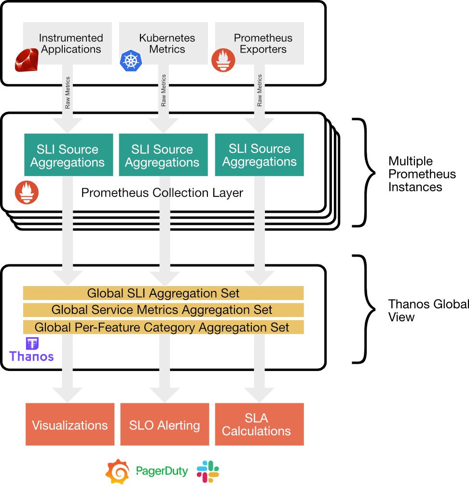
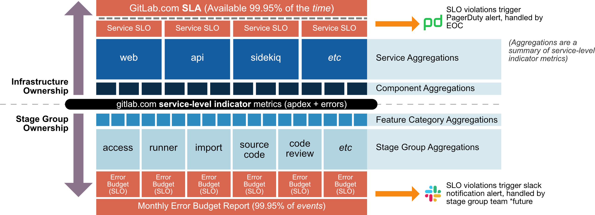

# Metrics Catalog

The metrics-catalog is a declarative approach to monitoring the GitLab.com application, intended to improve the consistency and
reduce repetition of configuration in our monitoring suite.

Andrew Newdigate gave a talk on this approach at ScaleConf in 2020, which provides a good overview of the approach we use at GitLab: [https://www.youtube.com/watch?v=2zL9DymXi1E](https://www.youtube.com/watch?v=2zL9DymXi1E).

## Structure

Each service in the application should have a matching file in the `services`
directory. The file should match the service identifier (its `type` label).

Each service has a set of "Service Level Indicators" (SLIs). For example, for the `web` service,
there are SLIs for `puma`, `workhorse` and `imagescaler`.

Each SLI is further broken down into three metrics: operations per second (operation rate), errors per second (error rate) and apdex score, which is a measurement of latency. The error rate is divided by the operation rate to provide an error ratio, which measures the percentage of operations to the SLI that are failing.

Each SLI is monitored against an SLO using Multi-window, Multi-burnrate alerting. Björn “Beorn” Rabenstein wrote [a guide to this technique](https://developers.soundcloud.com/blog/alerting-on-slos) and the Google SRE Workbook also includes [a chapter on it](https://sre.google/workbook/alerting-on-slos/).

## Defining Service Monitoring

This example shows how service monitoring is defined for a service.

For more examples, review `services/*.jsonnet`.

```jsonnet
metricsCatalog.serviceDefinition({
  type: 'service_type',     // The `type` identifier label for the service
  tier: 'sv',               // The `tier` identifier label for the service
  contractualThresholds: {  // Thresholds are used to calculate SLA metrics (selected services only)
    apdexRatio: 0.95,       // Apdex must be above this value for the service to be in SLA
    errorRatio: 0.005,      // Error ratio must be below this value for the service to in SLA
  },
  monitoringThresholds: {   // Monitoring thresholds are used for multiwindow, multi-burnrate alerting
    apdexScore: 0.999,      // Ratio of requests (in a one month period) that should meet their apdex thresholds
    errorRatio: 0.9999,     // Ratio of requests (in a one month period) that should complete without error
  },
  serviceDependencies: {    // A map of (downstream) services on which this service depends
    gitaly: true,
    praefect: true,
  },
  regional: true,           // If the service is spread over multiple regions and should be monitored as such
  serviceLevelIndicators: { // A map of SLIs for this service. The name is defined by the key
    workhorse: {            // Defines a service called `workhorse`
      // Each component must have a `requestRate` metric and optionally can have
      // an `apdex` (for latency) and an `errorRate` metric too.

      // Include an optional apdex score for this component...
      // `histogramApdex` declares the apdex metric is calculated from a histogram
     apdex: histogramApdex(                                                // See https://prometheus.io/docs/practices/histograms/#apdex-score
        histogram='gitlab_workhorse_http_request_duration_seconds_bucket', // The _bucket histogram metric to use
        selector='job="gitlab-workhorse-web"',                             // Any selectors to filter the metric with
        satisfiedThreshold=1,                                              // The bucket (eg `le="1"`) to use for the satisfactory threshold
        toleratedThreshold=10,
        metricsFormat='prometheus'                                         // Format of `le` labels on histograms, example of accepted values (prometheus: le="1"), (openmetrics: le="1.0"), (migrating: le=~"1|1.0")
      ),

      // requestRate is mandatory for all components
      // `rateMetric` declares the requestRate is calculated off a rate+counter
      requestRate: rateMetric(
        counter='gitlab_workhorse_http_requests_total',
        selector='job="gitlab-workhorse-web", type="web"'
      ),

      // errorRate is optional
      // `rateMetric` declares the errorRate is calculated off a rate+counter
      errorRate: rateMetric(
        counter='gitlab_workhorse_http_requests_total',
        selector='job="gitlab-workhorse-web", type="web", code=~"^5.*"'
      ),

      // significantLabels are a list of labels that will be used as dimensions in generated dashboards
      // they will also be included in source recording rules
      significantLabels: ['fqdn', 'route'],

      // dependsOn is a list of components of services that this sli has a hard
      // dependency on. Usually, we don't want to alert an upstream service if
      // the downstream service is firing alerts already.
      //
      // This should be used with caution, and only specify hard dependencies
      // that GitLab manages and alerts on.``
      dependsOn: [
        {
          component: 'rails_primary_sql',
          type: 'patroni',
        },
        {
          component: 'rails_replica_sql',
          type: 'patroni',
        },
      ],
    },

    puma: {                 // Defines a service called `puma`
      ...
    },
  },
})
```



This definition is used to generate several different configurations, including:

1. **Source recording rules** are generated for each metric, for each SLI, for each each service, for each burn rate.
   1. These recording rules evaluate application metrics into "normalized" _source_ recording rules.
   1. This takes place in the Prometheus instances, where the metrics have been scraped from the application.
   1. Since we have multiple Prometheus instances, these metrics present a single shard, split-brain, or local view.
   1. We do not use these for alerting, since they do not present a full picture of the system, only as viewed from a single Prometheus.
   1. This is the first step in reducing the cardinality of the application metrics before further aggregation at the global level.
   1. The global view is used for alerting, visualization, capacity planning etc.
1. **Aggregation recording rules**, defined as "aggregation sets".
   1. These are evaluated in [Thanos Ruler](https://github.com/thanos-io/thanos/blob/master/docs/components/rule.md) and consume the source recording rules.
   1. Thanos Ruler reads the source recording rules from Prometheus, and aggregates them into globally aggregated view of the metrics.
   1. It is possible to upscale aggregation sets for high cardinality metrics: This avoids loading many hours of high cardinality data from the source aggregation, but insteads uses the lower cardinality recording of a lower burn rate to scale up.
1. **SLO violation alerts** for each SLI for apdex and error ratios
1. **Weighted Average SLA** caclulation as described in https://about.gitlab.com/handbook/engineering/monitoring/
1. **Grafana Dashboards** for each service with SLI overview panels and detailed drilldown panels. See https://dashboards.gitlab.net/d/web-main for an example
1. **GitLab Dashboards**. See https://gitlab.com/gitlab-com/runbooks/-/metrics/key-metrics-web.yml for an example
1. **Alertmanager inhibit_rules** for each `dependsOn` it will create an [`inhibit_rule`](https://prometheus.io/docs/alerting/latest/configuration/#inhibit_rule) so the upstream service doesn't alert when the downstream service is already alerting. `dependsOn` should **only be used** when there is a hard dependency between two services for example `web -> patroni` and shouldn't be used for `web -> gitaly`. The following validation rules apply:
    1. It can't depend on an SLI of the same `type`.
    1. The `type` has to exist.
    1. The `component` has to exist and belong to the specified `type`.

### Available aggregation sets

The service level indicator definitions are rolled up in multiple
aggregations that are used for alerting and service monitoring on one
side, and the error budget for stage groups on the other:



All of the aggregation sets have several recordings for apdex and errors
by a burn rate. The most commonly used ones are:

1. The service aggregation: Used for an overall view of a service, on
   for example, the main service dashboards.

   1. `gitlab_service_apdex:ratio_[burnRate]`
   1. `gitlab_service_errors:rate_[burnRate]`

   For these metrics we also have a separation by region
   (`gitlab_service_regional_*`) and by node
   (`gitlab_service_node_*`).

1. The component aggregation: Used for SLO alerts and visible on the
   service dashboards

   1. `gitlab_component_apdex:ratio_[burnRate]`
   1. `gitlab_component_apdex:success:rate_[burnRate]`
   1. `gitlab_component_apdex:weight:score_[burnRate]`
   1. `gitlab_component_errors:ratio_[burnRate]`
   1. `gitlab_component_errors:rate_[burnRate]`
   1. `gitlab_component_ops:rate_[burnRate]`

   For these alerts, we also have separate recordings per region
   (`gitlab_regional_sli_*`) for kubernetes, or per node for VMs
   (`gitlab_component_node_*`).

1. Feature category recordings: these metrics are recorded from the
   source metrics using a feature category defined on the SLI (when a
   component has a single feature category), or using a
   `feature_category` label available on the source metrics.

   1. `gitlab:component:feature_category:execution:apdex:ratio_[burnRate]`
   1. `gitlab:component:feature_category:execution:apdex:success:rate_[burnRate]`
   1. `gitlab:component:feature_category:execution:apdex:weight:score_[burnRate]`
   1. `gitlab:component:feature_category:execution:error:ratio_[burnRate]`
   1. `gitlab:component:feature_category:execution:error:rate_[burnRate]`
   1. `gitlab:component:feature_category:execution:ops:rate_[burnRate]`

1. Stage group component recordings: these metrics use the feature category
   aggregation and join it with the
   [stage-group-mapping](../services/stage-group-mapping.jsonnet#L1). These
   are then used for the
   [error budget for stage groups](https://about.gitlab.com/handbook/engineering/error-budgets/#budget-spend-by-stage-group).

   1. `gitlab:component:stage_group:execution:apdex:success:rate_[burnRate]`
   1. `gitlab:component:stage_group:execution:apdex:weight:score_[burnRate]`
   1. `gitlab:component:stage_group:execution:apdex:ratio_[burnRate]`
   1. `gitlab:component:stage_group:execution:ops:rate_[burnRate]`
   1. `gitlab:component:stage_group:execution:error:rate_[burnRate]`
   1. `gitlab:component:stage_group:execution:success:rate_[burnRate]`
   1. `gitlab:component:stage_group:execution:error:ratio_[burnRate]`

An exhaustive list of aggregations can be found in
[`aggregation-sets.libsonnet`](aggregation-sets.libsonnet), where they
are defined.

## Development

Follow the instructions on
[the dashboards' README.md](../dashboards/README.md#local-development) to
install `jsonnet`.

To update the autogenerated file after you make your changes run
`make generate` from the project's root.

If you're adding a new service catalog make sure to append it to the list on the
`services/all.jsonet` file.
